<p align="center">
  
</p>

<h1 align="center">🚔 Copilot Wiggum</h1>

<p align="center">
  <strong>Multi-Agent Orchestrator for GitHub Copilot</strong><br>
  <em>"I'm helping!"</em>
</p>

<p align="center">
  <a href="#-quick-start">Quick Start</a> •
  <a href="#-how-it-works">How It Works</a> •
  <a href="#-usage">Usage</a> •
  <a href="#-dynamic-agents">Dynamic Agents</a>
</p>

---

## 🍩 What is this?

Copilot Wiggum is a **multi-agent orchestration system** for GitHub Copilot. It breaks down complex tasks into specialized sub-tasks, delegates them to expert agents, and synthesizes the results.

Think of it as Chief Wiggum managing a squad of specialist officers — each one handles their part, and the chief brings it all together.

## ⚡ Quick Start

### 1. Copy to your repo

```bash
# Clone this repo
git clone git@github.com:MrUnreal/copilot-wiggum.git

# Copy the .github folder to your project
cp -r copilot-wiggum/.github your-project/
```

### 2. Structure

```
your-project/
└── .github/
    ├── agents/
    │   └── orchestrator.agent.md    # The orchestrator agent
    ├── prompts/
    │   └── multi-agent-task.prompt.md   # Reusable prompt template
    └── copilot-instructions.md      # Auto-applied instructions
```

That's it! No preset agent configurations needed — the orchestrator generates specialized agents dynamically based on what each task requires.

### 3. Use it

In VS Code with GitHub Copilot Chat, type:

```
@Orchestrator Build a REST API for a blog with posts and comments
```

That's it! The orchestrator will:
1. Break down the task
2. Spawn specialized agents (research, backend, frontend, etc.)
3. Coordinate via shared memory
4. Synthesize the final result

## 🧠 How It Works

```mermaid
flowchart TD
    A[👤 YOU<br/>'Build feature X'] --> B[🎯 ORCHESTRATOR]
    
    B --> C[📋 Break down task<br/>into objectives]
    C --> D[🤖 Spawn specialist agents]
    D --> E[Research Agent]
    D --> F[Backend Agent]
    D --> G[Frontend Agent]
    D --> H[Testing Agent]
    D --> I[Security Agent]
    
    E --> J[📁 /memories/project-xxx/<br/>Shared memory for handoffs]
    F --> J
    G --> J
    H --> J
    I --> J
    
    J --> K[✅ Synthesize results]
    
    style A fill:#e1f5fe
    style B fill:#fff3e0
    style K fill:#c8e6c9
```



### Objective-Based Loops

Instead of fixed iteration counts, Wiggum uses **objectives**:

| ID | Objective | Status |
|----|-----------|--------|
| O1 | Handles null input | ✅ PASS |
| O2 | Validates required fields | ✅ PASS |
| O3 | Returns proper error format | 🔄 FAIL |

The loop continues until all objectives pass — not after N iterations.

### Resumeable State

All state is persisted to `/memories/`. If a session ends mid-task, the next session can resume exactly where it left off.

## 📖 Usage

### Option 1: Invoke the Agent

```
@Orchestrator <your complex task>
```

### Option 2: Use the Prompt Template

Open `.github/prompts/multi-agent-task.prompt.md` and fill in:
- Task description
- Project type
- Constraints

### Example Tasks

```
@Orchestrator Build a user authentication system with JWT tokens

@Orchestrator Create a dashboard with charts showing sales data

@Orchestrator Refactor the payment module to use Stripe

@Orchestrator Add comprehensive tests for the user service
```

## 🤖 Dynamic Agents

Unlike traditional setups with preset agent types, Wiggum **generates agents on-the-fly** and **iterates until objectives are met**:

```mermaid
flowchart TB
    subgraph iter1["🔄 ITERATION 1"]
        A1[🔧 Backend Engineer<br/>writes auth module] --> B1[🔍 Code Reviewer<br/>evaluates objectives]
        B1 --> C1{All objectives<br/>pass?}
        C1 -->|"❌ 2/4 passed"| D1[O1: Null handling ✅<br/>O2: bcrypt ✅<br/>O3: JWT refresh ❌<br/>O4: Rate limiting ❌]
    end
    
    D1 --> iter2
    
    subgraph iter2["🔄 ITERATION 2"]
        A2[🔧 Backend Engineer<br/>reads review, fixes issues] --> B2[🔍 Code Reviewer<br/>re-evaluates]
        B2 --> C2{All objectives<br/>pass?}
        C2 -->|"✅ 4/4 passed"| D2[O1: Null handling ✅<br/>O2: bcrypt ✅<br/>O3: JWT refresh ✅<br/>O4: Rate limiting ✅]
    end
    
    D2 --> E[✅ COMPLETE]
    
    style iter1 fill:#fff3cd,stroke:#ffc107
    style iter2 fill:#d4edda,stroke:#28a745
    style E fill:#28a745,color:#fff
```



### Objective-Driven, Not Iteration-Limited

The orchestrator doesn't stop after 3 tries. It continues until **all objectives pass**:

| Approach | How it works |
|----------|--------------|
| ❌ Fixed iterations | "Review 3 times then give up" |
| ✅ **Objective-based** | "Keep going until tests pass, security is verified, and code review approves" |

### Any Specialist You Need

The orchestrator spawns whatever expert the task requires:

| Common Agents | Specialized Agents |
|---------------|-------------------|
| Research Analyst | Data Pipeline Engineer |
| API Architect | ML Ops Specialist |
| Database Architect | Accessibility Expert |
| Frontend Engineer | Localization Specialist |
| Backend Engineer | Compliance Analyst |
| QA Engineer | DevRel Writer |
| Security Engineer | Cost Optimization Analyst |
| Code Reviewer | ... anything the task needs |

### Agent Prompt Generation

Each agent gets a custom prompt with:
- **Mission** — What exactly to accomplish
- **Context** — What to read from previous agents
- **Constraints** — Technology/style requirements  
- **Output** — Where to write results
- **Quality standards** — What "good" looks like

## 🔧 Customization

The orchestrator adapts to any project. Just describe what you need:

```
@Orchestrator Build a real-time chat system with WebSocket support, 
focusing on scalability and using our existing Express backend
```

The orchestrator will:
1. Analyze your requirements
2. Generate the right specialist agents
3. Include your constraints in each agent's prompt
4. Coordinate the work through shared memory

## 📝 Memory Structure

When running a task, Wiggum creates:

```
/memories/project-{id}/
├── objectives/           # What "done" looks like
├── code/                 # Versioned implementations
├── evaluations/          # Pass/fail for each objective
└── loop-state/           # Resumeable state
```

## 🚀 Requirements

- VS Code with GitHub Copilot extension
- GitHub Copilot Chat enabled
- Access to custom agents feature (`.github/agents/`)

## 📜 License

MIT — Do what you want with it.

---

<p align="center">
  <em>"Bake 'em away, toys!"</em>
</p>
