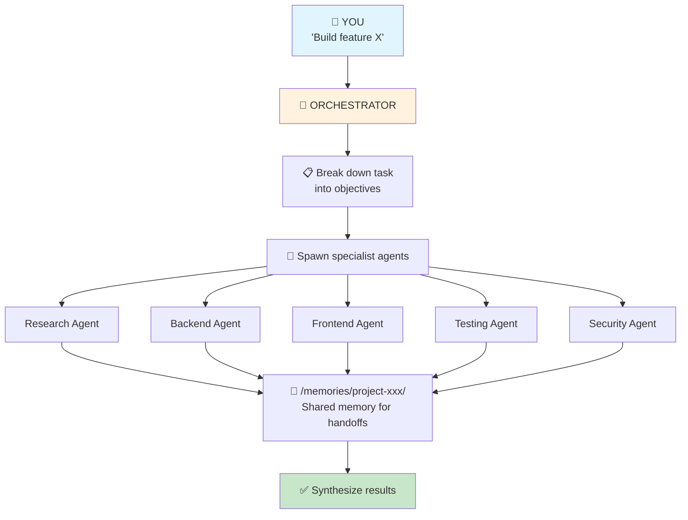
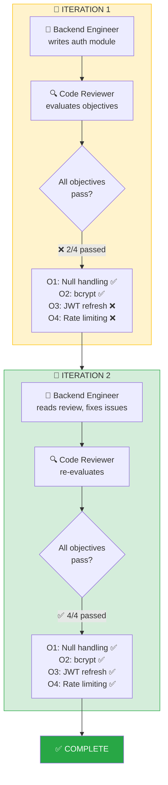

# 🧠 How It Works

> *"The doctor said I wouldn't have so many nosebleeds if I kept my finger outta there."* — Ralph, on debugging

## Architecture



## Objective-Based Loops

> *"When I grow up, I'm going to Bovine University!"* — Ralph, setting objectives

Instead of fixed iteration counts, Wiggum uses **objectives**:

| ID | Objective | Status |
|----|-----------|--------|
| O1 | Handles null input | ✅ PASS |
| O2 | Validates required fields | ✅ PASS |
| O3 | Returns proper error format | 🔄 FAIL |

The loop continues until all objectives pass — not after N iterations.

| Approach | How it works |
|----------|--------------|
| ❌ Fixed iterations | "Review 3 times then give up" |
| ✅ **Objective-based** | "Keep going until tests pass, security is verified, and code review approves" |

## Iteration Flow



## Resumeable State

All state is persisted to `/memories/`. If a session ends mid-task, the next session can resume exactly where it left off. *"I remember my first thought ever!"*

## Memory Structure

> *"I eated the purple berries!"* — Ralph, on persisting state

When running a task, Wiggum creates:

```
/memories/project-{id}/
├── objectives/           # What "done" looks like
├── code/                 # Versioned implementations
├── evaluations/          # Pass/fail for each objective
└── loop-state/           # Resumeable state
```

## Agent Prompt Generation

Each agent gets a custom prompt with:
- **Mission** — What exactly to accomplish
- **Context** — What to read from previous agents
- **Constraints** — Technology/style requirements  
- **Output** — Where to write results
- **Quality standards** — What "good" looks like
